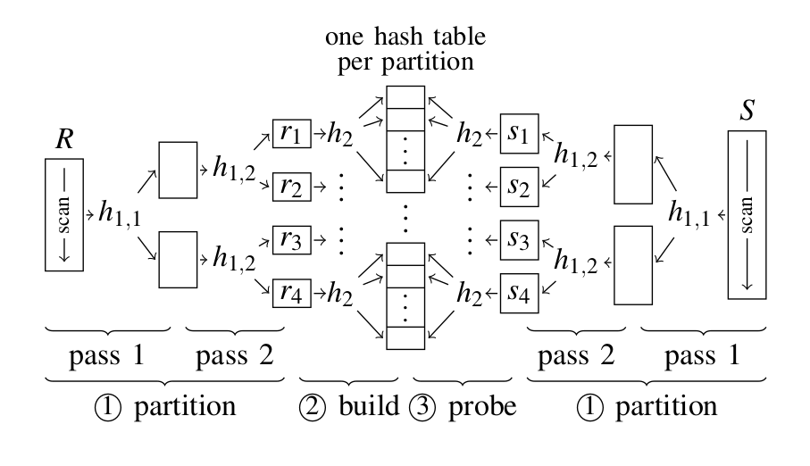
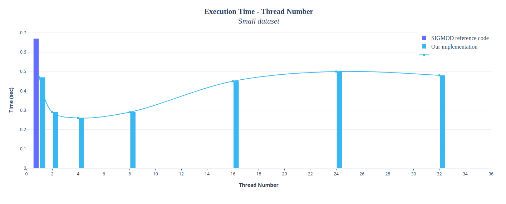
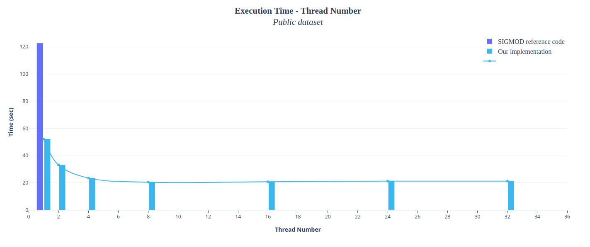
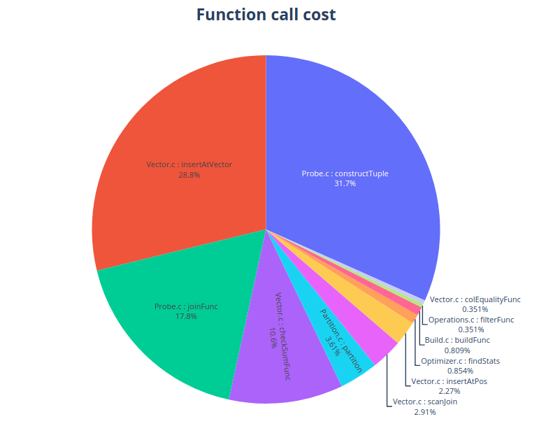

# Software Development for Database Systems

## About

The continuous advancement of technology used in the hardware domain has lead to the mass production of multi-core CPUs as well as to the decrease of RAM cost in terms of $/GB. In this project we demonstrate an efficient implementation of join operation in relational databases exploiting CPU parallelism and the large amount of available RAM in modern servers.

Our project, written in C language, was constructed in three parts which were then merged into a single one in a way, that complies with the instructions we were given. It features a hash-based radix partition join inspired by the join algorithms introduced in this [paper](https://15721.courses.cs.cmu.edu/spring2016/papers/balkesen-icde2013.pdf).

Additionally, it is worth mentioning that the idea of this project originated from the [SIGMOD Programming Contest 2018](http://sigmod18contest.db.in.tum.de/task.shtml). Thus, we follow the task specifications of the contest and we also utilize the testing workloads provided to the contestants.

## Implementation

* #### Query Execution

  Firstly, we collect various statistics concerning the input relations, such as max/min value, approximate number of discrete values e.t.c during the nontimed pre-processing stage. These stats can be useful for future work on query optimization.

  During the execution of the query we use an intermediate result structure to store the tuples resulted from each predicate, either a filter or a join. By doing that we manage to avoid scanning a relation from top to bottom multiple times when it is present in more than one predicates.

* #### Radix Hash Join

  The main idea of Radix Hash Join algorithm is to partition the input data of the two join relations in a number of buckets, so that the largest bucket can fit into the CPU cache. More precisely, the RHJ algorithm consists of the following three phases:

   * **Partition**

     We partition the data of each relation into a number of buckets by applying the same hash function (HASH_FUN_1) on both relations. In our implementation HASH_FUN_1 uses the n least-significant bits of the record to determine its bucket. In addition, histogram and prefix sum tables need to be calculated for each one of the two relations.

   * **Build**

     An index is created for each of the partitions (i.e: buckets) of the smallest relation. Each index resembles a hash table using two arrays (chain array and bucket array). These arrays are used to store indices of the corresponding bucket according to the hash value of a new hash function (HASH_FUN_2).

  * **Probe**

    Partitions of the non-indexed relation, i.e: the bigger one, are scanned and the respective index is probed for matching tuples.

  

  *Image above illustrates the three phases of Radix Hash Join Algorithm*

* #### Multithreading

  We managed to speed up our serial implementation by applying multithreading  on various parts of our code, such as filter execution, histogram creation, bucket indexing, probing e.t.c. We decided to make use of POSIX Threads for this purpose. You may modify the thread number [here](./final/src/JobScheduler.c). The following figures depict the satisfactory speedup we achieved.

  

  The above graph shows the correlation between execution time and number of threads using the [small](./final/workloads/small) dataset. For this test we used a machine from the Linux lab of our department (Intel i5-6500 3.2 GHz, 4 cores, 4 threads | 16 GB RAM )

  

  The above graph shows the correlation between execution time and number of threads using the *public* dataset which can be downloaded from [here](http://sigmod18contest.db.in.tum.de/public.tar.gz).

  Our machine's specifications are:
   * CPU: Ryzen 2400G 3.6 GHz , 4 cores , 8 threads
   * RAM: 16GB DDR4 dual-channel

## Usage

  * ``cd final``
  * ``./compile.sh && ./runTestHarness.sh``

## Unit Testing

  For unit testing we use the [CUnit](http://cunit.sourceforge.net/index.html) testing framework. Tests are added to different suites, each one being responsible for testing a specific category of functions. In order to run the tests CUnit must be [installed](http://archive15.fossology.org/projects/fossology/wiki/Installing_CUnit) on your system.  

#### Running the tests
  * ``cd final``
  * ``make unittest && ./runUnitTesting.sh``

## Profiling

This pie graph was generated using profiling data collected by  [callgrind's](http://valgrind.org/docs/manual/cl-manual.html#cl-manual.options.separation) function cost mechanism.

1. `constructTuple` : creates a new tuple that will be added to the join result

2. `insertAtVector` : inserts the tuple into the result vector

3. `joinFunc` : implements Probing (phase 3)

4. `checkSumFunc` : calculates checksums after query's execution is finished

5. `partition` : implements Partition (phase 2)

You may also run a memory check using valgrind by uncommenting the line you wish in [run.sh](./final/run.sh) script.

## Authors

  * George Panagiotopoulos @giorgospan
  * John Papastamou @JohnThePriest 

## References

  * Cagri Balkesen, Jens Teubner, Gustavo Alonso, and M. Tamer Özsu
  [Main-Memory Hash Joins on Multi-Core CPUs: Tuning to the Underlying Hardware](https://15721.courses.cs.cmu.edu/spring2016/papers/balkesen-icde2013.pdf)

